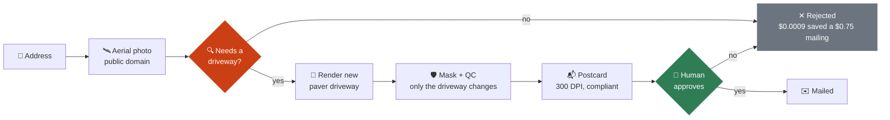
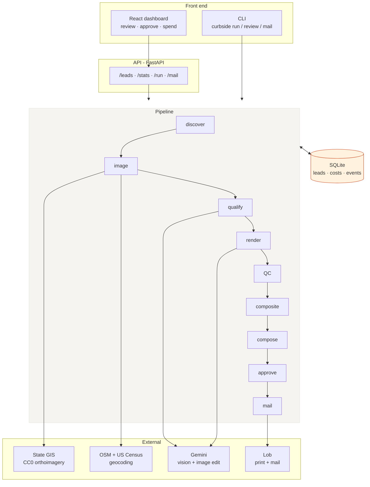
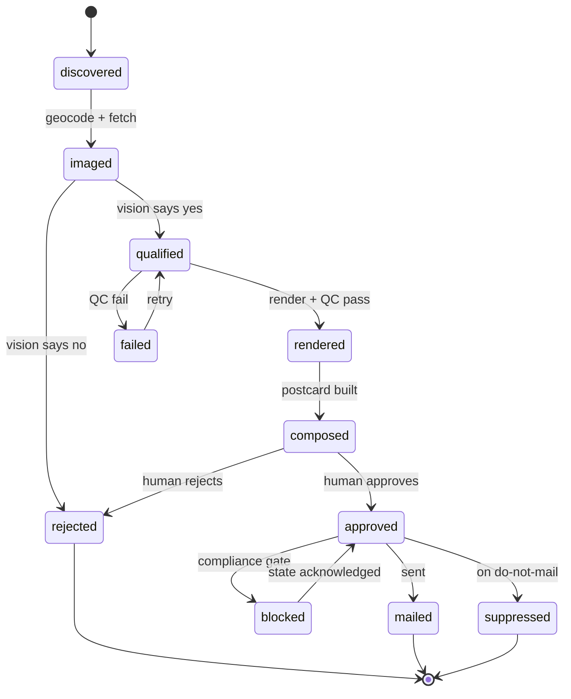
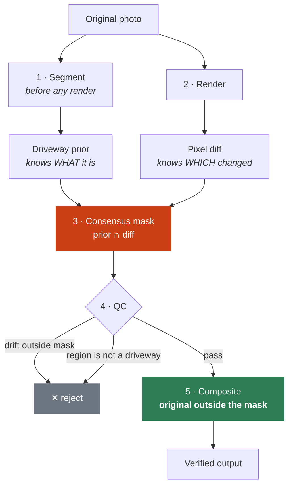
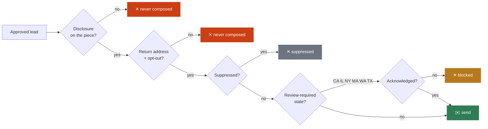
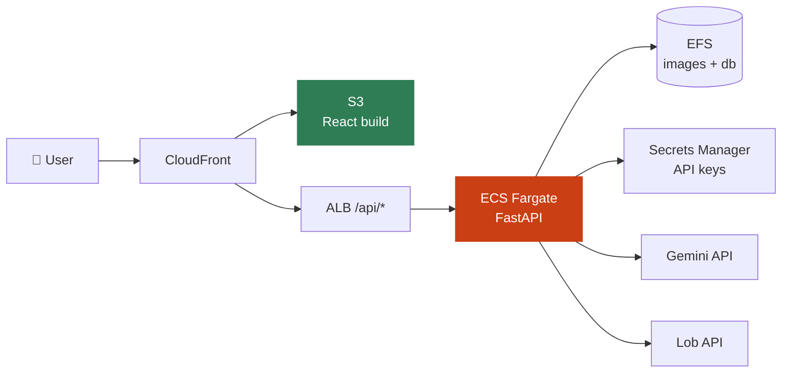

# Curbside

**AI-rendered direct mail for home-services contractors.**

Takes a US street address, pulls a public-domain aerial photograph of that
property, decides whether the driveway needs replacing, renders a new one onto
the homeowner's own photo, and produces a print-ready, legally compliant
postcard - with a human approving every piece before anything is mailed.

```
$0.82 per mailed postcard · 91% of that is print and postage
```

---

## What it does



The recipient opens their mail and sees **their own house** with a new
driveway on it. That recognition is the entire product; everything else is
plumbing built to deliver it safely and legally.

---

## Architecture



The CLI and the API are two front ends onto the **same stage functions**. No
business logic lives in the HTTP layer.

---

## The state machine

Every lead carries a state. Each stage picks up whatever is ready for it, so a
failure at render never re-costs geocoding or qualification.



Addresses are normalized and `UNIQUE`, so re-running never duplicates a lead
and never double-mails an address.

---

## How the render is made trustworthy

The model is asked to change only the driveway. Nothing makes it obey, so its
output is **never trusted directly**.



**Why consensus.** The segmentation prior knows *what a driveway is* but traces
it loosely. The render diff knows *exactly which pixels changed* but not what
they are. Their intersection is both precise and semantically anchored. If the
prior is unusable, it degrades to diff-only rather than failing.

**Why composite.** The output is rebuilt as *original everywhere, rendered only
inside the mask*. Pixels outside the mask are **unchanged by construction, not
by instruction**. Proven by test: when the model rewrites the house, the house
still survives.

**Two-axis QC.** Boundary QC measures drift outside the mask. Semantic QC asks
a vision model what the masked region actually *is* - a roof or road can pass a
drift check while being completely wrong.

---

## Why the imagery comes from state GIS

Every commercial imagery provider prohibits this use case, and several name
print and advertising explicitly.

| Provider | Blocking term |
|---|---|
| Google Street View / Maps | *"may not be used for any print purposes … Advertisements or promotional materials of any kind"* - no exceptions granted |
| Vexcel | "Commercial Purpose" includes *"advertising, marketing materials"*; "Derivatives" exclude *"the images or pixels themselves"* |
| Nearmap · EagleView | Internal use only, no redistribution |
| Mapbox | *"shall not use Licensed Map Content in print"* |
| Bing | Permits print ads, but *"no alteration except to resize"* |
| MLS listing photos | Photographer holds copyright - **$750–$150,000 statutory exposure per photo** |

Several US states publish orthoimagery under **CC0-1.0**, the only license that
cleanly permits commercial derivative works in print.

```
$ curbside sources
 * indiana           3.0in  CC0-1.0                      IN
   connecticut       3.0in  CC0-1.0                      CT
   north_carolina    6.0in  public-domain-unrestricted   NC
```

Adding a state is one entry in `curbside/config.py`. Full analysis, including
the traps found (Texas reports `CC0-1.0` on a $6,000–$375,000/yr
subscription-only service), is in **[docs/LICENSING.md](docs/LICENSING.md)**.

---

## Compliance is enforced in code

CC0 resolves copyright. It does **not** resolve right of publicity, intrusion
upon seclusion, or state UDAP exposure from mailing someone an AI-altered image
of their own home.



- **Disclosure is mandatory** - composition raises rather than produce a piece
  without one. Weak wording is rejected, not accepted.
- **Return address and opt-out** are printed on every piece.
- **Review-required states are gated** until explicitly acknowledged.
- **Suppression is checked twice** - at discover and again at send.
- **Live mail requires four independent opt-ins**: a `live_*` key,
  `CURBSIDE_ALLOW_LIVE_MAIL=1`, a complete return address, and full suppression
  coverage (DMAchoice, USPS Deceased DNC, NCOALink).

See **[docs/COMPLIANCE.md](docs/COMPLIANCE.md)**. *Not legal advice* - it
encodes conservative defaults so the open questions are reviewed, not missed.

---

## Quick start

```bash
# backend
pip install -e ".[api,dev]"

export GEMINI_API_KEY=...                       # billed Google Cloud project
export CURBSIDE_FROM_NAME="Heartland Driveway Co."
export CURBSIDE_FROM_LINE1="1400 N Meridian St"
export CURBSIDE_FROM_CITY="Indianapolis"
export CURBSIDE_FROM_STATE="IN"
export CURBSIDE_FROM_ZIP="46202"

curbside doctor                 # what is configured, what would block a send
curbside --budget 3.00 run      # discover → compose
curbside review                 # pending approval, with QC detail
curbside approve --all
curbside mail                   # dry run by default

# API + dashboard
uvicorn curbside.api.app:app --reload    # http://localhost:8000/docs
cd web && npm install && npm run dev     # http://localhost:5173
```

Global CLI flags precede the subcommand: `--budget`, `--limit`, `--db`.

---

## Deployment



See **[docs/DEPLOY.md](docs/DEPLOY.md)** for the AWS walkthrough. SQLite on EFS
is fine to the low thousands of leads; past that, move to RDS Postgres and S3
for imagery - the store is the only module that changes.

---

## Layout

```
curbside/
  config.py             settings, imagery sources
  store.py              SQLite state machine, costs, events
  pipeline.py           stages: discover → mail
  cli.py                command-line interface
  api/                  FastAPI app + response schemas
  sources/              geocoding, state GIS imagery
  vision/gemini.py      qualify, render, structured vision
  render/
    segmentation.py     driveway priors, consensus masking
    compositing.py      masked merge, boundary + semantic QC
  compose/postcard.py   300 DPI composition, mask-centred framing
  mail/providers.py     dry-run and Lob adapters
  compliance/policy.py  disclosure, state gating, campaign preflight
web/                    React dashboard (Vite)
tests/                  65 tests, no network required
docs/                   licensing, compliance, deployment
```

---

## Economics

Measured, per 1,000 leads with the qualifier rejecting ~60%:

| Stage | Cost | Share |
|---|---|---|
| Geocode + imagery | $0.00 | 0% |
| Qualify (1,000) | $0.90 | 0.3% |
| Segment + render + QC (400) | $27.44 | 8.4% |
| Print + postage (400) | $300.00 | **91.3%** |
| **Total** | **$328.34** | **$0.82 / piece** |

Mail dominates. The qualifier is the highest-value component in the system: it
costs under a tenth of a cent per house and each correct rejection saves ~$0.75.

---

## Known limits

- **Top-down, not front elevation.** Legally usable imagery is aerial. For
  driveways this arguably reads better; it is not what a listing photo shows.
- **Imagery is 3–4 years old** on state refresh cycles.
- **Geocoding is approximate.** OSM gives rooftop precision for most addresses;
  some fall back to street centreline.
- **Segmentation is a bounding box, not a polygon.** Vision models trace boxes
  far more reliably; the render diff supplies the true boundary. A dedicated
  segmentation model would be stronger.
- **Property sourcing is not built.** Production needs recently-sold records:
  county recorder + assessor (free) or ListSource (~$0.31/record). The
  assessor's owner field lags the recorder's deed by weeks - reading only the
  assessor roll mails the *previous* owner.

---

## Testing

```bash
python3 -m pytest tests/ -q      # 65 tests, no network, no API keys
```
