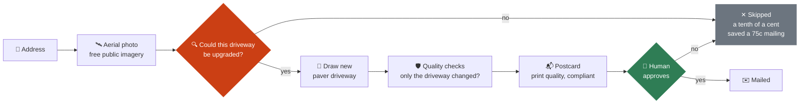
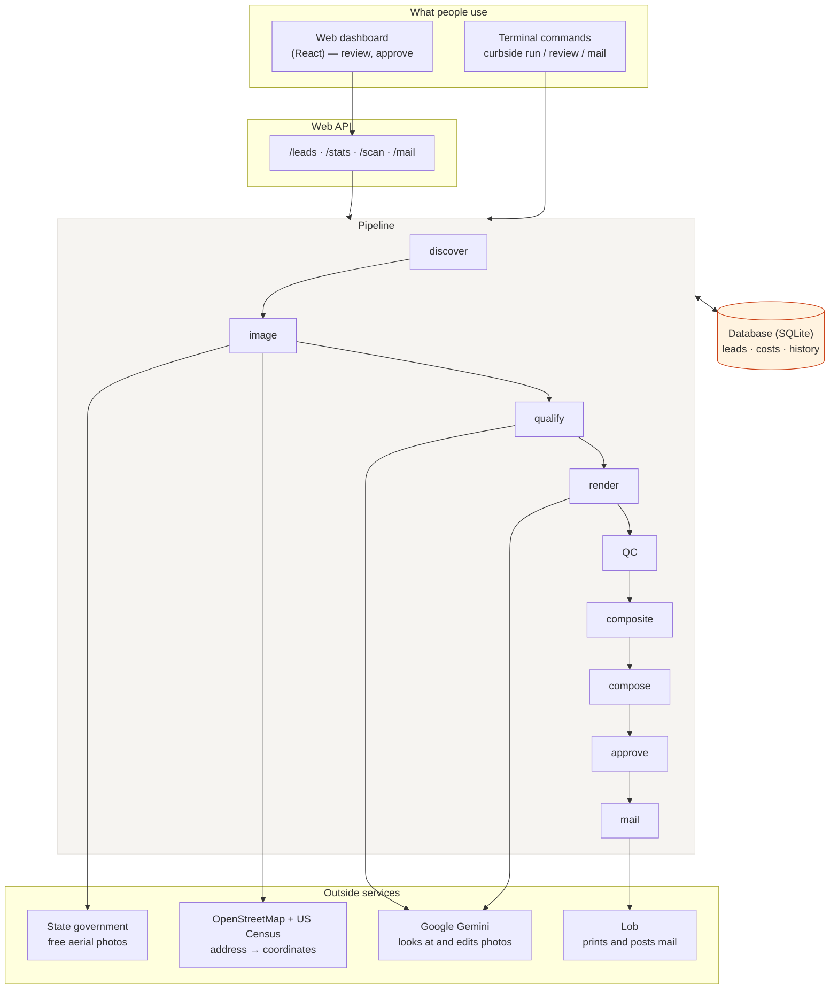
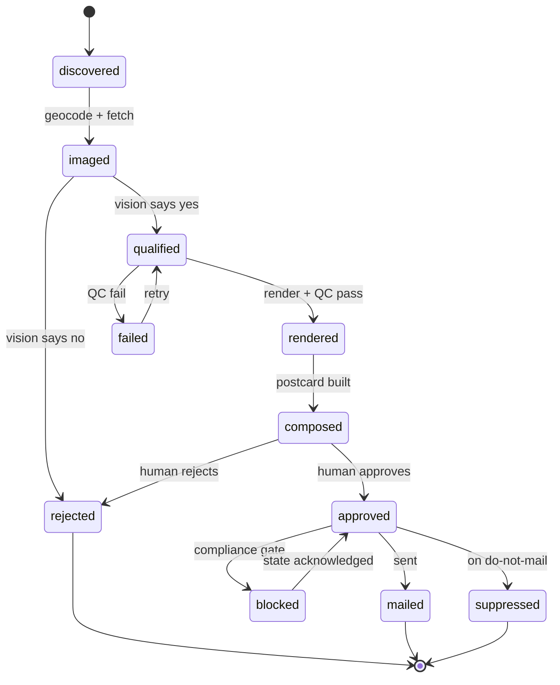
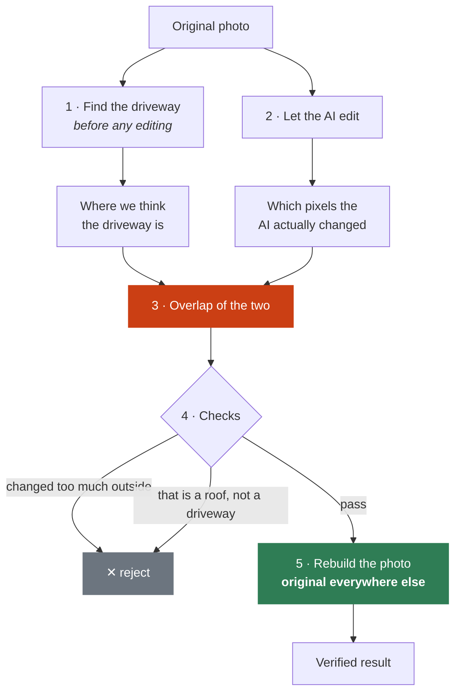
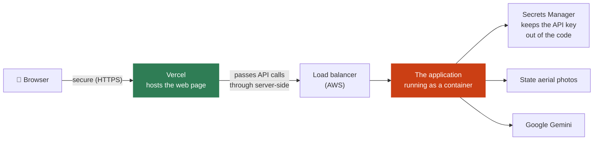

# Curbside

**Turns one street address into ready-to-mail postcards that show homeowners
their own house with a new driveway on it.**

**Live demo: <https://web-zeta-dusky-84.vercel.app/>** — type an Indiana
address, or click one of the example blocks. A scan of six homes takes about
a minute.

---

## What this is, in plain terms

Driveway contractors have a marketing problem: they do not know which houses
need their service. Mailing a flyer to every home in a city is mostly wasted
paper and postage.

Curbside solves that. Give it one address — say, a job the contractor is
already working on — and it:

1. **Finds the neighbours.** Looks up every property on that block from public
   government land records.
2. **Gets a photo of each one.** A top-down aerial photograph, from imagery the
   state publishes for free public use.
3. **Judges each driveway.** An AI looks at the photo and decides whether that
   driveway could be upgraded. Houses with no driveway, or that are not
   single-family homes, are skipped.
4. **Draws the new driveway.** A second AI edits the photo, replacing the old
   driveway with new paving — *changing nothing else in the picture*.
5. **Checks its own work.** Automated quality checks reject bad edits, so a
   wrong result is thrown away rather than mailed.
6. **Builds the postcard.** Before-and-after side by side, print quality, with
   the legally required disclosures on it.
7. **Waits for a person.** Nothing is mailed until a human approves it.

The point is step 4. The recipient opens their post and sees **their own
house** with a new driveway. That recognition is the entire product —
everything else exists to deliver it safely and legally.

> **Note on the AI edits.** The "after" image is a computer-generated
> illustration, not a photo of real work. Every postcard says so in print.

---

## Words used in this README

Skip this if the terms are familiar.

| Term | What it means here |
|---|---|
| **Lead** | One property being considered for a postcard |
| **Geocoding** | Turning a street address into map coordinates |
| **Aerial / orthoimagery** | A photo taken straight down from a plane, corrected so distances are true — like a map you can see through |
| **Parcel** | A property boundary in government land records |
| **Public domain / CC0** | Content free for anyone to use, including commercially, with no permission needed |
| **Render** | Having an AI redraw part of a photo |
| **Mask** | The exact region of a photo we allow the AI to change — everything outside it is left untouched |
| **QC (quality control)** | Automated checks that inspect the AI's output and reject bad results |
| **Dry run** | The system does everything except actually post the mail; it writes a receipt instead |
| **Suppression list** | Addresses that must never be mailed |
| **API** | The part of the software other programs talk to, rather than people |
| **CLI (command line)** | Running the tool by typing commands in a terminal |
| **Container** | The application packaged with everything it needs, so it runs identically anywhere |
| **DPI** | Dots per inch — print resolution. 300 DPI is standard for professional printing |

---

## Two ways to use it

**Scan a block** — the product. Type one address, get postcards for every
neighbour worth mailing. This is what the live demo shows.

```
✓ Finding address coordinates      1240 Fairfield Ave, Indianapolis, IN
✓ Scanning neighbouring properties 6 homes found
✓ Fetching aerial imagery          6 imaged
✓ Analysing 6 driveways            2 candidates, 4 skipped
✓ Rendering 2 driveways + checks   2 passed, 0 rejected
✓ Laying out postcards             2 ready to send
```

**Pipeline** — the operations console, for whoever runs campaigns. Batch runs,
quality-check detail, spend broken down by stage, and the approval queue.

---

## How the pieces fit together



**Why the skip step matters.** Judging a driveway costs about a tenth of a
cent. Printing and posting a card costs about 75 cents. So every house
correctly skipped pays for hundreds of judgements. It is the cheapest step and
the most valuable one.

---

## How the software is put together

The same engine sits behind both the web page and the terminal commands.



The terminal commands and the web dashboard are two doors into the **same
code**. Neither has logic the other lacks, so anything you can do in the
browser you can also script, and they can never disagree.

---

## Tracking each property through the stages

Every property moves through a series of stages, and the system records which
stage each one has reached. Each stage picks up whatever is ready for it.

This matters for cost. If drawing the driveway fails, only that step is
retried — the system does not pay again to look the address up or fetch the
photo. Work already done is never repeated.



Addresses are cleaned up and stored uniquely, so running the same scan twice
never creates a duplicate — and never posts two cards to the same house.

---

## How we stop the AI ruining the photo

This is the part most of the engineering went into.

We ask the AI to change only the driveway. Nothing *forces* it to obey — it
will sometimes repaint the roof, pave the street, or redraw the whole picture.
And the moment the house stops looking like the recipient's house, the postcard
becomes ordinary junk mail.

So the AI's output is **never used as-is**. It is checked, trimmed, and
partially discarded first.



**Why we combine two signals.** One AI locates the driveway before any editing
happens, but traces it loosely. Comparing the before and after photos shows
*exactly* which pixels changed, but not what those pixels are. Where the two
agree is both precise and actually a driveway. If the first signal is
unusable, the system falls back to the second rather than giving up.

**Why we rebuild the photo.** The final image is assembled as *the original
everywhere, with the AI's version pasted in only inside the approved region*.
Everything outside is untouched **because it was never copied from the AI**,
not because we asked nicely. There is a test for this: when the AI rewrites
the house, the house still comes back unchanged.

**Two different checks.** The first measures how much changed outside the
approved region. The second shows the changed area to an AI and asks what it
is — because a roof or a road can pass the first check while being completely
the wrong thing.

**Catching the street.** The most common wrong answer is the public road: it is
paved, sits right beside the driveway, and is often the largest paved area in
view. Asked *"is this a driveway?"* the AI agrees. Asked to **count the cars on
it**, it answers accurately — and a driveway does not hold two cars parked in a
row. That count overrides the AI's own verdict.

---

## Why the photos come from state governments, not Google

This was the single biggest constraint on the whole project.

The obvious source for aerial photos is Google. But **Google's terms of use
forbid exactly what this product does** — taking their imagery, altering it,
and printing it in an advertisement. So do the terms of every other commercial
provider we checked. Several name printing and advertising explicitly.

These are the actual quoted terms:

| Provider | Blocking term |
|---|---|
| Google Street View / Maps | *"may not be used for any print purposes … Advertisements or promotional materials of any kind"* - no exceptions granted |
| Vexcel | "Commercial Purpose" includes *"advertising, marketing materials"*; "Derivatives" exclude *"the images or pixels themselves"* |
| Nearmap · EagleView | Internal use only, no redistribution |
| Mapbox | *"shall not use Licensed Map Content in print"* |
| Bing | Permits print ads, but *"no alteration except to resize"* |
| Estate-agent listing photos | The photographer owns the copyright, not the listing site. Using them risks **$750–$150,000 in damages per photo** under US copyright law |

**The way around it:** several US states photograph their own territory from
the air and publish the results under **CC0** — a licence that puts the images
in the public domain. Anyone may use them, alter them, and print them
commercially, with no permission required. It is the only licence found that
cleanly allows all three.

```
$ curbside sources
 * indiana           3.0in  CC0-1.0                      IN
   connecticut       3.0in  CC0-1.0                      CT
   north_carolina   19.7in  public-domain-unrestricted   NC  (too coarse)
```

The number is how much ground each pixel covers. **3 inches per pixel** is
sharp enough to make out the edge of a driveway; **20 inches** is not, which
is why North Carolina is listed but refused for drawing.

Adding a state is one entry in `curbside/config.py`. The full analysis — 
including the trap where Texas advertises a free licence on a service that
actually costs $6,000–$375,000 a year — is in
**[docs/LICENSING.md](docs/LICENSING.md)**.

---

## The legal safeguards are built into the code

Using public-domain photos settles the **copyright** question. It does not
settle three others, and posting someone an AI-altered picture of their home
raises all three:

- **Right of publicity** — using a person's property in an advert aimed at them
- **Intrusion upon seclusion** — a privacy claim some US states recognise
- **Consumer-protection law** — an altered image shown without a clear label
  can count as misleading advertising

None of these are solved by having the right photo licence, so the code
enforces conservative defaults instead of leaving them to memory:

- **Every card must say the image is a rendering.** The software refuses to
  build a postcard without that wording, and rejects vague substitutes.
- **Every card carries a return address and a way to opt out** of future mail.
- **Six states are blocked by default** — California, Illinois, New York,
  Massachusetts, Washington and Texas have the most assertive privacy and
  advertising laws. Mailing there requires someone to explicitly acknowledge it.
- **Do-not-mail addresses are checked twice** — when the lead is created, and
  again immediately before sending.
- **Actually posting mail requires four separate switches** to be turned on,
  so it cannot happen by accident. One of them is proof that the national
  opt-out registries have been loaded — the mail industry's do-not-contact
  lists, including one for deceased recipients.

See **[docs/COMPLIANCE.md](docs/COMPLIANCE.md)** for the detail. **This is not
legal advice** — it encodes cautious defaults so the open questions get
reviewed by a lawyer rather than quietly missed.

---

## Finding homes that recently sold — for free

The original brief was to target people who had just bought a house, on the
theory that a new owner still has budget for exterior work.

In the US, **property sales are public record** — when a house changes hands,
the county writes it in a public register. That is why an entire industry
resells this data. It also means some of it can be read directly from the
government, at no cost and with no account required.

| Source | How current | Includes sale price | Licence |
|---|---|---|---|
| **Wake County, NC** (Raleigh) | about 9 days behind | yes | not stated (public records) |
| **Connecticut** (statewide) | about 11 months behind | yes | **public domain** |

```bash
$ curbside sales-sources

# freshest - genuinely "sold in the last six months"
$ curbside run --sales wake_nc --sold-within-months 6 \
               --min-price 200000 --max-year-built 2005
```

These records already include map coordinates, so those properties **skip the
address-lookup step entirely** — which is both faster and avoids the one-request-
per-second rate limit on the free address lookup service.

Two filters worth understanding:

- `--sold-within-months` counts back from the **newest record in the data**,
  not from today. Government sites publish on a delay, so asking for "the last
  six months" by the calendar would often return nothing at all.
- `--max-year-built` excludes newly built houses. Recent sales skew heavily
  towards new construction, whose driveways are already new — in Wake County,
  filtering to homes built before 2000 cut 7,650 candidates down to 2,806
  actually worth mailing.

**What these are for.** They are wired up for development and testing. Only
Connecticut grants explicit public-domain rights. The county sites publish
openly but state no licence at all — which means *we found no restriction*,
not *commercial use is permitted*. The code records that distinction for each
source rather than blurring it. A real commercial campaign should either get
the publisher's terms reviewed or buy a properly licensed list.

## Running it yourself

You need Python 3.12, Node.js, and a Google Gemini API key (the account must
have billing enabled — the image-editing model has no free tier).

```bash
# install the Python side, then the web page's dependencies
pip install -e ".[api,dev]"
cd web && npm install && cd ..

# The API key is kept OUTSIDE the project folder so it can never be
# committed to git by accident.
echo 'GEMINI_API_KEY=AIza...' > ~/.gemini_env && chmod 600 ~/.gemini_env

# A postal return address is legally required on mailed advertising, so the
# software refuses to build a postcard without one.
cp .env.example .env

# load both into the current terminal (needed once per terminal window)
set -a; source ~/.gemini_env; source .env; set +a
```

### The web version

```bash
./run-local.sh     # starts both halves: the engine and the web page
```

Then open <http://localhost:5173> and type an Indiana address, or click one of
the examples. A six-home block takes 50–70 seconds and costs about 20 cents in
AI calls.

*(It starts two programs: the engine on port 8000 and the web page on 5173.
The page talks to the engine. Both need to be running.)*

### The terminal version

```bash
curbside doctor               # shows what is configured and what is missing
curbside --budget 3.00 run    # process the addresses in data/addresses.txt
curbside review               # what is waiting for approval, with check results
curbside approve --all
curbside mail                 # practice run by default — sends nothing
```

Settings like `--budget` go **before** the command word, not after:
`curbside --budget 3.00 run`, not `curbside run --budget 3.00`.

### What costs money

Almost nothing does. Address lookup, the aerial photos, the quality checks,
building the postcard, the test suite, and practice mail runs are all free.
**Only the AI calls are billed.**

| Action | Cost |
|---|---|
| Judging one driveway | $0.0009 (a tenth of a cent) |
| Drawing a new driveway + checking it | about $0.07 |
| A six-home block scan | about $0.20 |

`CURBSIDE_BUDGET` sets a hard ceiling, checked before every paid call, so the
system stops rather than overspends. It counts only real AI charges —
the estimated printing and postage costs shown in reports are not real money
and never eat into it.

See **[docs/RUNNING.md](docs/RUNNING.md)** for troubleshooting.

---

## Deployment

Deployed and running at **<https://web-zeta-dusky-84.vercel.app/>**.

The web page is hosted on **Vercel** (free, fast, gives you HTTPS). The
application itself runs on **AWS** as a container — the app packaged with
everything it needs — so it behaves identically on a laptop and in the cloud.



```bash
export AWS_PROFILE=<profile>
export AWS_REGION=us-east-1
export GEMINI_API_KEY=...

./deploy-ecs.sh          # packages the app, uploads it, deploys, prints the URL

cd web
sed -i "s|REPLACE_WITH_ALB_DNS|<alb-dns>|" vercel.json
npm run build && npx vercel deploy --prod

./destroy-ecs.sh         # removes everything, stops billing
```

### Four problems this deployment hit

Recorded because each cost real time, and the next person will hit them too.

**AWS's simplest option was unavailable.** App Runner, the easiest way to run a
container, is switched off on free-plan AWS accounts — it refuses in every
region. The fallback (ECS Fargate) uses building blocks every account has, so
`deploy-ecs.sh` is the path that works. `deploy-apprunner.sh` is kept for
accounts where the simpler option is enabled.

**The AWS address is insecure (`http://`), the web page is secure
(`https://`).** Browsers block a secure page from calling an insecure one.
Giving AWS a proper certificate requires owning a domain name. Instead, the
web page asks *Vercel* for data, and Vercel fetches it from AWS behind the
scenes — so the browser only ever sees a secure connection, and the insecure
hop happens server-side where no browser is watching.

**The first deploy always fails.** AWS creates a required internal permission
the first time you deploy — but the deploy that triggers it is the one that
fails. Running the script a second time works. It is safe to re-run, so that
is the fix. This is not a configuration error, and chasing it as one wastes
an hour.

**Nothing is saved between restarts.** There is no attached disk, so if the
container restarts, generated postcards are cleared and the user scans again.
Fine for a short demo. For anything longer, attach storage or save results to
cloud storage instead.

### Cost

| | Two days |
|---|---|
| Running the application | $2.37 |
| Load balancer (the public address) | $1.46 |
| Storage for the packaged app + the API key | $0.03 |
| **Total** | **$3.86** |

Left running for a month it becomes **$58.74**, so `./destroy-ecs.sh` removes
everything when the demo is over.

See **[docs/DEPLOY.md](docs/DEPLOY.md)** for the full walkthrough and
**[docs/DEMO.md](docs/DEMO.md)** for troubleshooting.

---

## Layout

```
curbside/
  config.py             settings: which state, spending caps, check thresholds
  store.py              the database — every property, its stage, what it cost
  pipeline.py           the seven stages, run several properties at once
  cli.py                the terminal commands
  api/app.py            the web interface other programs talk to
  sources/
    geocode.py          address → map coordinates (two free services)
    imagery.py          fetches the state's aerial photos, retries on failure
    block.py            one address → every neighbour on that block
    sales.py            recently-sold homes from public government records
  vision/gemini.py      talking to the AI: judging photos and editing them
  render/
    segmentation.py     working out where the driveway is
    compositing.py      keeping the original photo outside the edited area,
                        and the checks that reject bad edits
  compose/postcard.py   laying out the printable postcard
  mail/providers.py     practice-run sender, plus a real print-and-post service
  compliance/policy.py  the legal safeguards: disclosure, blocked states

web/                    the web page people use
tests/                  117 automated checks, no internet or API key needed
docs/                   running it, photo licensing, legal notes, deployment

Dockerfile              recipe for packaging the app to run anywhere
deploy-ecs.sh           deploy to AWS            ← the one that works
destroy-ecs.sh          remove everything, stop the billing
deploy-apprunner.sh     simpler AWS option (needs a paid-plan account)
run-local.sh            start both halves on your own machine
```

---

## Testing

```bash
python3 -m pytest tests/ -q          # 117 checks — no internet, no API key
python3 -m pytest tests/ -q -m ""    # plus 7 that call live public services
```

The seven that need the internet are excluded by default, so the suite runs
anywhere in about two seconds and costs nothing.

The most important one proves the safety guarantee: it feeds in an AI result
that has wrecked the house, and asserts the finished image still contains the
**original** house. That is the promise the whole rendering pipeline rests on,
so it is tested rather than assumed.
