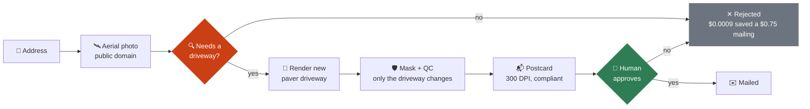
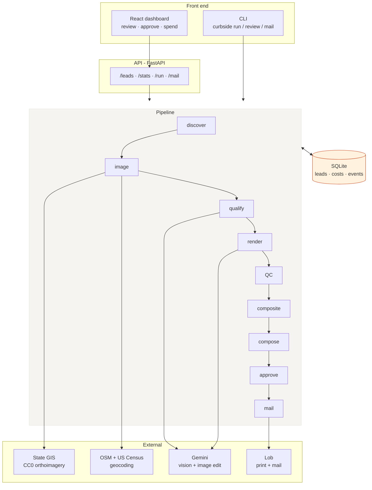
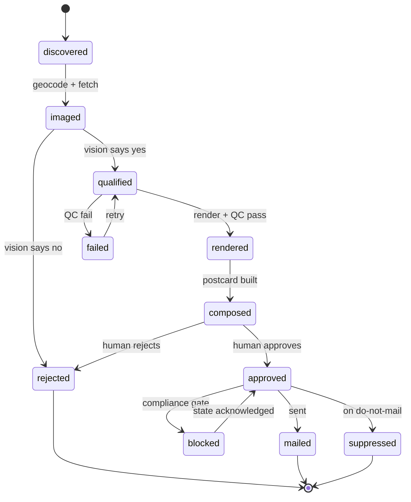
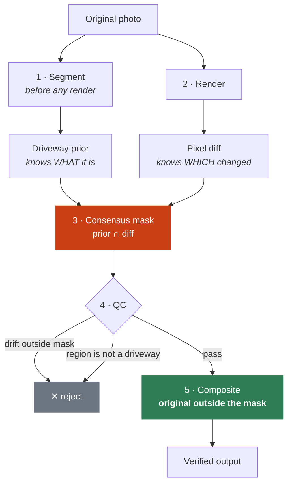
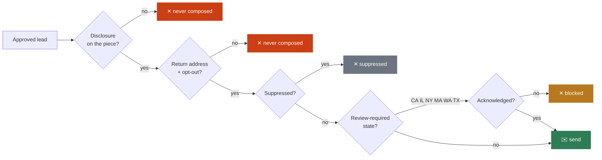
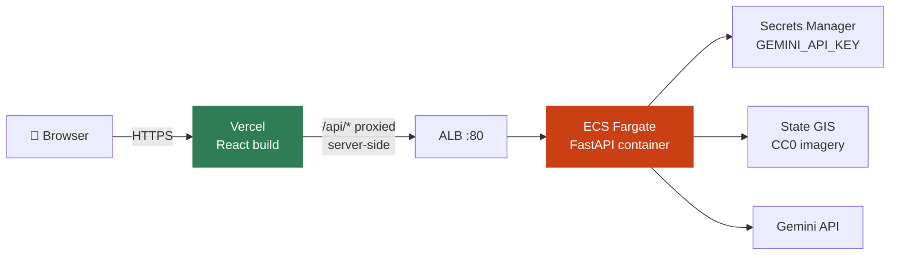

# Curbside

**AI-rendered direct mail for home-services contractors.**

Takes a US street address, pulls a public-domain aerial photograph of that
property, decides whether the driveway needs replacing, renders a new one onto
the homeowner's own photo, and produces a print-ready, legally compliant
postcard - with a human approving every piece before anything is mailed.

```
$0.82 per mailed postcard · 91% of that is print and postage
```

**Live demo: <https://web-zeta-dusky-84.vercel.app/>** — type an Indiana
address or click a verified block. A six-home scan takes about a minute.

---

## Two ways in

**Scan a block** — the product. Type one address, get postcards for every
neighbour worth mailing.

```
✓ Finding address coordinates      1240 Fairfield Ave, Indianapolis, IN
✓ Scanning neighbouring properties 6 homes found
✓ Fetching aerial imagery          6 imaged
✓ Analysing 6 driveways            2 candidates, 4 skipped
✓ Rendering 2 driveways + QC       2 passed, 0 rejected
✓ Laying out postcards             2 ready to send
```

**Pipeline** — the operations console. Batch runs, QC detail, spend by stage,
and the approval queue.

## What it does



The recipient opens their mail and sees **their own house** with a new
driveway on it. That recognition is the entire product; everything else is
plumbing built to deliver it safely and legally.

---

## Architecture



The CLI and the API are two front ends onto the **same stage functions**. No
business logic lives in the HTTP layer.

---

## The state machine

Every lead carries a state. Each stage picks up whatever is ready for it, so a
failure at render never re-costs geocoding or qualification.



Addresses are normalized and `UNIQUE`, so re-running never duplicates a lead
and never double-mails an address.

---

## How the render is made trustworthy

The model is asked to change only the driveway. Nothing makes it obey, so its
output is **never trusted directly**.



**Why consensus.** The segmentation prior knows *what a driveway is* but traces
it loosely. The render diff knows *exactly which pixels changed* but not what
they are. Their intersection is both precise and semantically anchored. If the
prior is unusable, it degrades to diff-only rather than failing.

**Why composite.** The output is rebuilt as *original everywhere, rendered only
inside the mask*. Pixels outside the mask are **unchanged by construction, not
by instruction**. Proven by test: when the model rewrites the house, the house
still survives.

**Two-axis QC.** Boundary QC measures drift outside the mask. Semantic QC asks
a vision model what the masked region actually *is* - a roof or road can pass a
drift check while being completely wrong.

---

## Why the imagery comes from state GIS

Every commercial imagery provider prohibits this use case, and several name
print and advertising explicitly.

| Provider | Blocking term |
|---|---|
| Google Street View / Maps | *"may not be used for any print purposes … Advertisements or promotional materials of any kind"* - no exceptions granted |
| Vexcel | "Commercial Purpose" includes *"advertising, marketing materials"*; "Derivatives" exclude *"the images or pixels themselves"* |
| Nearmap · EagleView | Internal use only, no redistribution |
| Mapbox | *"shall not use Licensed Map Content in print"* |
| Bing | Permits print ads, but *"no alteration except to resize"* |
| MLS listing photos | Photographer holds copyright - **$750–$150,000 statutory exposure per photo** |

Several US states publish orthoimagery under **CC0-1.0**, the only license that
cleanly permits commercial derivative works in print.

```
$ curbside sources
 * indiana           3.0in  CC0-1.0                      IN
   connecticut       3.0in  CC0-1.0                      CT
   north_carolina    6.0in  public-domain-unrestricted   NC
```

Adding a state is one entry in `curbside/config.py`. Full analysis, including
the traps found (Texas reports `CC0-1.0` on a $6,000–$375,000/yr
subscription-only service), is in **[docs/LICENSING.md](docs/LICENSING.md)**.

---

## Compliance is enforced in code

CC0 resolves copyright. It does **not** resolve right of publicity, intrusion
upon seclusion, or state UDAP exposure from mailing someone an AI-altered image
of their own home.



- **Disclosure is mandatory** - composition raises rather than produce a piece
  without one. Weak wording is rejected, not accepted.
- **Return address and opt-out** are printed on every piece.
- **Review-required states are gated** until explicitly acknowledged.
- **Suppression is checked twice** - at discover and again at send.
- **Live mail requires four independent opt-ins**: a `live_*` key,
  `CURBSIDE_ALLOW_LIVE_MAIL=1`, a complete return address, and full suppression
  coverage (DMAchoice, USPS Deceased DNC, NCOALink).

See **[docs/COMPLIANCE.md](docs/COMPLIANCE.md)**. *Not legal advice* - it
encodes conservative defaults so the open questions are reviewed, not missed.

---

## Finding recently-sold homes — free

Property transfers are public record, so several jurisdictions publish them
directly. Both adapters are keyless and free.

| Source | Freshness | Sale price | Licence |
|---|---|---|---|
| **Wake County, NC** | ~9 days | yes | unstated (public records) |
| **Connecticut** | ~11 months | yes | **Public Domain** |

```bash
$ curbside sales-sources

# freshest - genuinely "sold in the last six months"
$ curbside run --sales wake_nc --sold-within-months 6 \
               --min-price 200000 --max-year-built 2005
```

Rows carry coordinates (Wake returns parcel polygons, CT returns points), so
these leads **skip geocoding entirely** and its 1 req/sec limit.

Two filters that matter:

- `--sold-within-months` is measured from the **dataset's newest record**, not
  from today. Portals publish on a lag, so a calendar window often returns
  nothing.
- `--max-year-built` excludes new construction. Recent sales skew heavily to
  new builds whose driveways are already new — in Wake County, filtering to
  homes built before 2000 cuts 7,650 candidates to 2,806 genuinely worth
  mailing.

**Intended use.** These are wired up for development and verification. Only
Connecticut carries an explicit public-domain grant; the county portals
publish openly but state no licence, which means *no restriction found*, not
*commercial redistribution granted*. Each adapter reports `commercial_use` so
the distinction stays visible. A commercial campaign should review the
publisher's terms or move to a licensed source.

## Quick start

```bash
pip install -e ".[api,dev]"
cd web && npm install && cd ..

# secrets live outside the repo
echo 'GEMINI_API_KEY=AIza...' > ~/.gemini_env && chmod 600 ~/.gemini_env
cp .env.example .env          # return address - required to compose a piece

set -a; source ~/.gemini_env; source .env; set +a
```

### The product — block scan

```bash
./run-local.sh                # starts API :8000 and dashboard :5173
```

Open <http://localhost:5173>, type an Indiana address or click a verified
example. About 50–70 seconds for a six-home block, roughly 20c of model calls.

### The operations console — CLI

```bash
curbside doctor               # what is configured, what would block a send
curbside --budget 3.00 run    # batch from data/addresses.txt
curbside review               # pending approval, with QC detail
curbside approve --all
curbside mail                 # dry run by default, sends nothing
```

Global flags precede the subcommand: `--budget`, `--limit`, `--db`.

### What costs money

Free: geocoding, imagery, compositing, QC arithmetic, postcard composition,
tests, dry-run mail. Only the model calls bill.

| Action | Cost |
|---|---|
| Qualify one address | $0.0009 |
| Segment + render + semantic QC | ~$0.07 |
| **A qualified lead, end to end** | **~$0.07** |
| A six-home block scan | ~$0.20 |

`CURBSIDE_BUDGET` is a hard ceiling checked before every paid call. It guards
API spend only — modelled print-and-postage never consumes it.

See **[docs/RUNNING.md](docs/RUNNING.md)** for troubleshooting.

---

## Deployment

Deployed live at **<https://web-zeta-dusky-84.vercel.app/>** — the React build
sits on Vercel; the API runs as a container on ECS Fargate behind a load
balancer.



```bash
export AWS_PROFILE=<profile>
export AWS_REGION=us-east-1
export GEMINI_API_KEY=...

./deploy-ecs.sh          # builds, pushes to ECR, deploys, prints the ALB DNS

cd web
sed -i "s|REPLACE_WITH_ALB_DNS|<alb-dns>|" vercel.json
npm run build && npx vercel deploy --prod

./destroy-ecs.sh         # removes everything, stops billing
```

### Three things this deployment had to solve

**App Runner was unavailable.** A free-plan AWS account returns
`SubscriptionRequiredException` for App Runner in every region. ECS Fargate
uses primitives every account has, so `deploy-ecs.sh` is the working path;
`deploy-apprunner.sh` is kept for accounts where it is enabled.

**The ALB serves HTTP only.** Terminating TLS on it needs an ACM certificate,
which needs a domain. A browser on an HTTPS page refuses to call an HTTP API,
so `web/vercel.json` proxies `/api` **server-side** — the browser stays on
HTTPS and the plaintext hop happens between Vercel and AWS. The frontend
defaults to a relative `/api`, so no build-time API URL is needed.

**ECS creates its service-linked role lazily.** The first `create-service`
call on a new account fails *while* creating `AWSServiceRoleForECS`. Re-running
succeeds. The script is idempotent, so a retry is the fix.

**State is container-local.** No EFS volume: a task restart clears generated
scans and the user scans again. Acceptable for a short-lived demo; mount a
volume or sync to S3 if results need to survive.

### Cost

| | Two days |
|---|---|
| Fargate 1 vCPU / 2 GB | $2.37 |
| ALB hourly + LCU | $1.46 |
| ECR + Secrets Manager | $0.03 |
| **Total** | **$3.86** |

Left running a month it is **$58.74** — tear it down.

See **[docs/DEPLOY.md](docs/DEPLOY.md)** for the full walkthrough and
**[docs/DEMO.md](docs/DEMO.md)** for troubleshooting.

---

## Layout

```
curbside/
  config.py             settings, imagery sources, QC thresholds
  store.py              SQLite state machine, costs, events
  pipeline.py           stages: discover → mail, concurrent, scopeable
  cli.py                command-line interface
  api/app.py            FastAPI: block scan, leads, stats, per-card send
  sources/
    geocode.py          OSM Nominatim → US Census fallback
    imagery.py          state GIS orthoimagery, retries on 5xx
    block.py            one address → every neighbour worth mailing
    sales.py            recently-sold records from public data
  vision/gemini.py      qualify, render ladder, structured vision
  render/
    segmentation.py     driveway priors, consensus masking
    compositing.py      masked merge, boundary + semantic QC
  compose/postcard.py   300 DPI composition, mask-centred framing
  mail/providers.py     dry-run and Lob adapters
  compliance/policy.py  disclosure, state gating, campaign preflight

web/                    React dashboard (Vite) + vercel.json proxy
tests/                  117 tests, no network or API keys required
docs/                   running, licensing, compliance, deployment

Dockerfile              container image
deploy-ecs.sh           deploy to ECS Fargate + ALB    ← the working path
destroy-ecs.sh          tear it all down
deploy-apprunner.sh     App Runner variant (needs a paid-plan account)
run-local.sh            start API + dashboard together
```

---

## Economics

Measured, per 1,000 leads with the qualifier rejecting ~60%:

| Stage | Cost | Share |
|---|---|---|
| Geocode + imagery | $0.00 | 0% |
| Qualify (1,000) | $0.90 | 0.3% |
| Segment + render + QC (400) | $27.44 | 8.4% |
| Print + postage (400) | $300.00 | **91.3%** |
| **Total** | **$328.34** | **$0.82 / piece** |

Mail dominates. The qualifier is the highest-value component in the system: it
costs under a tenth of a cent per house and each correct rejection saves ~$0.75.

---

## Known limits

- **Top-down, not front elevation.** Legally usable imagery is aerial. For
  driveways this arguably reads better; it is not what a listing photo shows.
- **Imagery is 3–4 years old** on state refresh cycles.
- **Geocoding is approximate.** OSM gives rooftop precision for most addresses;
  some fall back to street centreline.
- **Segmentation is a bounding box, not a polygon.** Vision models trace boxes
  far more reliably; the render diff supplies the true boundary. A dedicated
  segmentation model would be stronger.
- **Render reliability.** Roughly one render in three fails QC. The retry
  ladder recovers most, and the safety layer rejects the rest — so a scan
  returns fewer cards than homes rather than wrong ones.
- **Indiana and Connecticut only.** NC OneMap measures ~20 in/px, too coarse
  to resolve a driveway edge, so rendering refuses on it by design.
- **Sale-date targeting needs a layer that carries one.** Wake County NC does;
  Indiana's parcel layer does not, so the filter is unavailable there rather
  than silently returning everything.

---

## Testing

```bash
python3 -m pytest tests/ -q          # 117 tests, no network, no API keys
python3 -m pytest tests/ -q -m ""    # + 7 that hit live public endpoints
```

Network tests are marked and deselected by default, so the suite runs offline.
The load-bearing test asserts that when the model rewrites the house,
compositing returns the original — the guarantee the render pipeline rests on.
