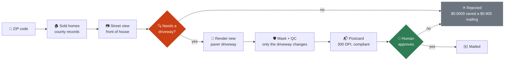
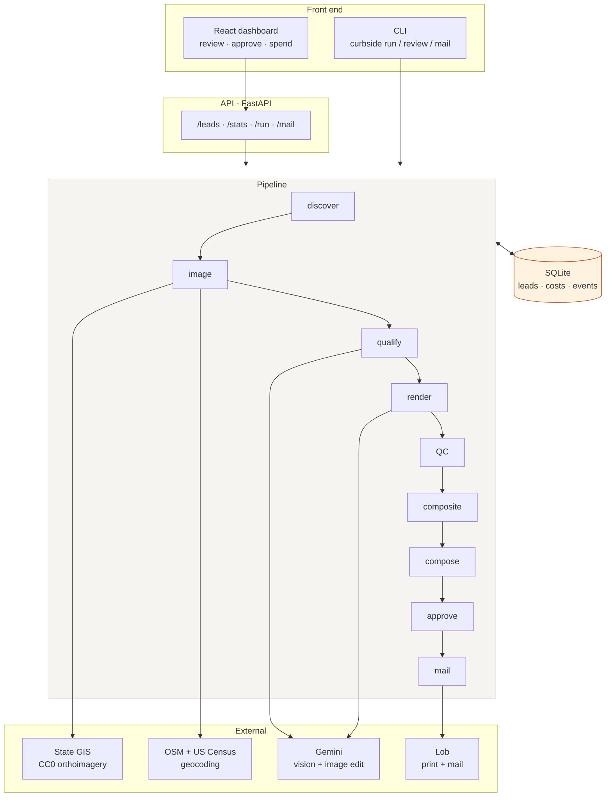
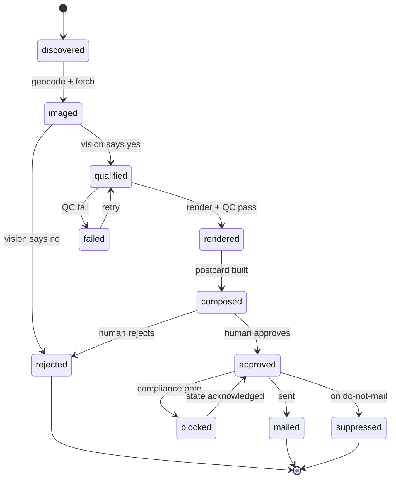
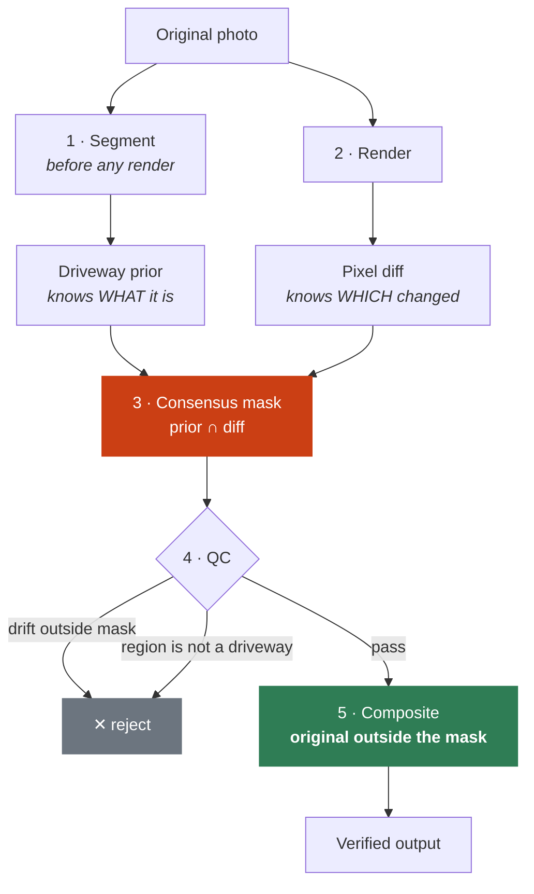
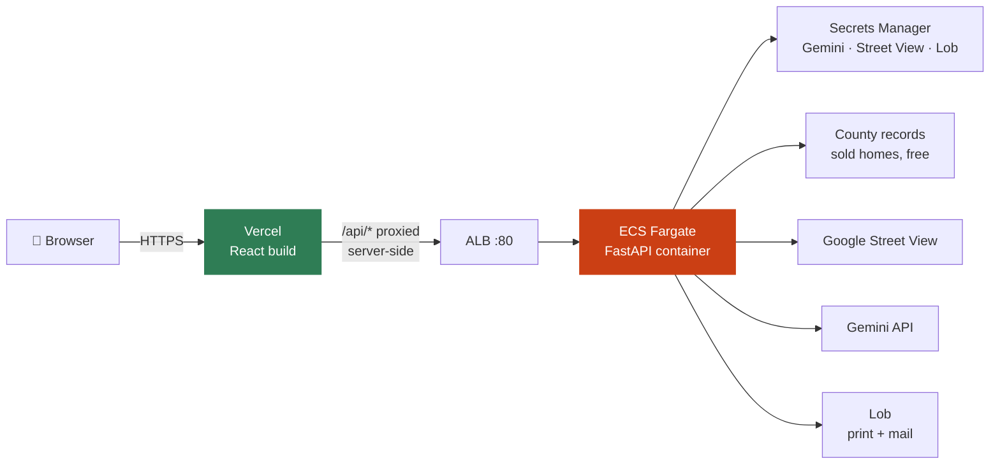

# Curbside

**AI-rendered direct mail for driveway contractors.**

Name a market - a ZIP code - and Curbside pulls every home that sold there
recently from county public records, photographs each one from the street,
decides which have a driveway worth upgrading, renders a new driveway onto the
homeowner's own photo, and produces a print-ready, legally compliant postcard.
A human approves every piece before anything is mailed.

**Live demo: <https://web-zeta-dusky-84.vercel.app/>** - enter a South East
Florida ZIP (33019, 33156, 33480) or scan a single block.

---

## Two ways in

**Target a market** - the product. A contractor names a ZIP, not an address.

```
✓ Searching county records for 33019   20 sold over $700,000
✓ Building the mailing list            20 to process
✓ Fetching street view photos          18 imaged
✓ Analysing 18 driveways               2 candidates, 16 skipped
✓ Rendering 2 driveways + QC           2 passed, 0 rejected
✓ Laying out postcards                 2 ready for review
```

The signal is a **recent high-value sale**: a new owner with budget, in the
months when exterior work actually gets commissioned.

**Scan a block** - the secondary path. Type one job-site address, get
postcards for the neighbours worth mailing. Useful when the contractor is
already standing on the street.

**Pipeline** - the operations console. Batch runs, QC detail, spend by stage,
and the approval queue.

*A **lead** is one property under consideration. **QC** is the automated
quality control that inspects each AI edit and rejects bad ones.*

## What it does


```mermaid
flowchart LR
    A["📮 ZIP code"] --> A2["🏠 Sold homes<br/>county records"]
    A2 --> B["📷 Street view<br/>front of house"]
    B --> C{"🔍 Needs a<br/>driveway?"}
    C -->|no| X["✕ Rejected<br/>$0.0009 saved a $0.905 mailing"]
    C -->|yes| D["🎨 Render new<br/>paver driveway"]
    D --> E["🛡️ Mask + QC<br/>only the driveway changes"]
    E --> F["📬 Postcard<br/>300 DPI, compliant"]
    F --> G{"👤 Human<br/>approves"}
    G -->|yes| H["✉️ Mailed"]
    G -->|no| X

    style C fill:#cb3f14,stroke:#cb3f14,color:#fff
    style G fill:#2f7d55,stroke:#2f7d55,color:#fff
    style X fill:#6c757f,stroke:#6c757f,color:#fff
```

The recipient opens their mail and sees **their own house** with a new
driveway on it. That recognition is the entire product; everything else is
plumbing built to deliver it safely and legally.

---

## Architecture


```mermaid
flowchart TB
    subgraph client["Front end"]
        UI["React dashboard<br/>review · approve · spend"]
        CLI["CLI<br/>curbside run / review / mail"]
    end

    subgraph api["API - FastAPI"]
        REST["/leads · /stats · /run · /mail"]
    end

    subgraph core["Pipeline"]
        direction TB
        S1["discover"] --> S2["image"] --> S3["qualify"]
        S3 --> S4["render"] --> S5["QC"] --> S6["composite"]
        S6 --> S7["compose"] --> S8["approve"] --> S9["mail"]
    end

    subgraph ext["External"]
        GIS["State GIS<br/>CC0 orthoimagery"]
        GEO["OSM + US Census<br/>geocoding"]
        GEM["Gemini<br/>vision + image edit"]
        LOB["Lob<br/>print + mail"]
    end

    DB[("SQLite<br/>leads · costs · events")]

    UI --> REST --> core
    CLI --> core
    S2 --> GIS
    S2 --> GEO
    S3 --> GEM
    S4 --> GEM
    S9 --> LOB
    core <--> DB

    style core fill:#f6f4f1,stroke:#e6e3de
    style DB fill:#fff3e0,stroke:#cb3f14
```

The CLI and the API are two front ends onto the **same stage functions**. No
business logic lives in the HTTP layer.

---

## The state machine

Every lead carries a state. Each stage picks up whatever is ready for it, so a
failure at render never re-costs geocoding - turning an address into map
coordinates - or qualification.


```mermaid
stateDiagram-v2
    [*] --> discovered
    discovered --> imaged: geocode + fetch
    imaged --> qualified: vision says yes
    imaged --> rejected: vision says no
    qualified --> rendered: render + QC pass
    qualified --> failed: QC fail
    rendered --> composed: postcard built
    composed --> approved: human approves
    composed --> rejected: human rejects
    approved --> mailed: sent
    approved --> blocked: compliance gate
    approved --> suppressed: on do-not-mail
    blocked --> approved: state acknowledged
    failed --> qualified: retry

    rejected --> [*]
    mailed --> [*]
    suppressed --> [*]
```

Addresses are normalized and `UNIQUE`, so re-running never duplicates a lead
and never double-mails an address.

---

## How the render is made trustworthy

Rendering here means having the AI redraw part of a photograph. The **mask** is
the region we permit it to touch; everything outside is left alone.

The model is asked to change only the driveway. Nothing makes it obey, so its
output is **never trusted directly**.


```mermaid
flowchart TB
    ORIG["Original photo"] --> SEG["1 · Segment<br/><i>before any render</i>"]
    ORIG --> REN["2 · Render"]
    SEG --> PRIOR["Driveway prior<br/><i>knows WHAT it is</i>"]
    REN --> DIFF["Pixel diff<br/><i>knows WHICH changed</i>"]
    PRIOR --> CONS["3 · Consensus mask<br/>prior ∩ diff"]
    DIFF --> CONS
    CONS --> QC{"4 · QC"}
    QC -->|"drift outside mask"| FAIL["✕ reject"]
    QC -->|"region is not a driveway"| FAIL
    QC -->|pass| COMP["5 · Composite<br/><b>original outside the mask</b>"]
    COMP --> OUT["Verified output"]

    style CONS fill:#cb3f14,stroke:#cb3f14,color:#fff
    style COMP fill:#2f7d55,stroke:#2f7d55,color:#fff
    style FAIL fill:#6c757f,stroke:#6c757f,color:#fff
```

**Why consensus.** The segmentation prior knows *what a driveway is* but traces
it loosely. The render diff knows *exactly which pixels changed* but not what
they are. Their intersection is both precise and semantically anchored.

At **aerial** level an unusable prior degrades to diff-only. At **street**
level it refuses. The frame there holds lawn, walkways and the neighbours'
frontage, and a mask built from the change alone cannot tell which of them the
renderer touched - that is how a paved lawn reaches a postcard. Refusing costs
a lead; the alternative costs a mailing that shows the wrong surface paved.

**Why composite.** The output is rebuilt as *original everywhere, rendered only
inside the mask*. Pixels outside the mask are **unchanged by construction, not
by instruction**. Proven by test: when the model rewrites the house, the house
still survives.

**Two-axis QC.** Boundary QC measures drift outside the mask. Semantic QC asks
a vision model what the masked region actually *is* - a roof or road can pass a
drift check while being completely wrong.

**A bug worth recording.** The segmentation model answers in one of three
conventions - normalized 0-1, raw pixels, or Gemini's 0-1000 grid - and the
response does not say which. Reading a grid value as a pixel put the box
outside the frame on a 640px image, which emptied it, dropped the prior, and
made every lead on a block refuse. The symptom looked like "street level does
not work"; the cause was one unit conversion.

---

## Imagery: two modes, and an open licensing question

The product runs in one of two modes, set by `CURBSIDE_VIEW`.

**`street`** - Google Street View, a photograph of the front of the house.
This is what the driveway product ships with, because a driveway is a frontage
feature and the client asked for it directly: *"for the driveway app I would
prefer the generated driveway to be rendered onto a street view picture of the
front of the house."*

**`aerial`** - state or county orthoimagery under CC0-1.0. Better licensed,
and the right choice for anything photographed from above.

### The unresolved part

Street View is **not licensed for print**. Google's Geo Guidelines are
explicit, and the table below is the reason aerial was built first. Running in
`street` mode is a deliberate prototype decision, taken knowingly, and it is a
genuine blocker before a commercial campaign - not a detail to discover later.

Every commercial imagery provider prohibits this use case, and several name
print and advertising explicitly.

| Provider | Blocking term |
|---|---|
| Google Street View / Maps | *"may not be used for any print purposes … Advertisements or promotional materials of any kind"* - no exceptions granted |
| Vexcel | "Commercial Purpose" includes *"advertising, marketing materials"*; "Derivatives" exclude *"the images or pixels themselves"* |
| Nearmap · EagleView | Internal use only, no redistribution |
| Mapbox | *"shall not use Licensed Map Content in print"* |
| Bing | Permits print ads, but *"no alteration except to resize"* |
| MLS listing photos | Photographer holds copyright - **$750–$150,000 statutory exposure per photo** |

Several US states publish orthoimagery - aerial photography corrected so
distances measure true, like a photographic map - under **CC0-1.0**, a
public-domain dedication and the only licence that cleanly permits commercial
derivative works in print.

```
$ curbside sources
 * indiana           3.0in  CC0-1.0                      IN
   connecticut       3.0in  CC0-1.0                      CT
   north_carolina    6.0in  public-domain-unrestricted   NC
```

Adding a state is one entry in `curbside/config.py`. Full analysis, including
the traps found (Texas reports `CC0-1.0` on a $6,000–$375,000/yr
subscription-only service), is in **[docs/LICENSING.md](docs/LICENSING.md)**.

### Street level is harder than aerial

An aerial tile is centred on the parcel. Street View is centred on a point on
the *road*, so one house's photograph routinely contains its neighbours'
frontage too - and the renderer has no way to know which driveway belongs to
the address it was given. Three things address that:

- the field of view is computed from the camera-to-house distance, so roughly
  one lot width is in frame at any range
- county parcel centroids aim the camera, where a parcel layer exists
- a lead is refused outright when no driveway prior can be established, rather
  than falling back to "whatever changed in the photo"

Measured effect on real Florida blocks: **1-2 mailable cards per 6 homes.**
The rest are refused for good reasons - duplexes, front walkways mistaken for
driveways, and homes behind hedges. In the most expensive ZIPs (Palm Beach
33480, median sale $11.5M) the yield approaches zero, because those homes are
screened from the road by design. High property value and street-level
visibility are inversely correlated.

---

## The postcard

Built to Lob's 4x6 template: 4.25 x 6.25 in with bleed, trimmed to 4 x 6, at
300 DPI. Size is a postage decision - USPS charges letter rate up to 4.25x6
and flat rate above it, and Lob's price follows the same split. The artwork
and the `size` field in the API call must agree or the printer rejects it.

**Verified against a real proof, not the docs.** Two test postcards were sent
through Lob and the returned PDFs inspected. Lob trimmed to exactly 432 x 288
pt (6 x 4 in) and placed the recipient block, barcode, return address and
postage into its own reserved zone on the back. Three things only that proof
revealed:

- `use_type` is mandatory - the first send failed with HTTP 422. Every piece
  would have failed in production.
- Lob's sandbox does not run address verification, so *every* real address
  comes back undeliverable on a test key. The documented stand-in is
  substituted in test mode and flagged `simulated` so a sandbox receipt is
  never mistaken for evidence that an address is real.
- The container had no fonts. `python:*-slim` ships without DejaVu, so the
  headline silently fell back to a bitmap default and rendered unreadably
  small. Nothing errored; every test passed; only the printed proof showed it.

**Don't design the back.** Lob owns that area and prints into it. A
collaborator on a sibling project spent days reconciling a web preview against
Lob's generated PDF; the piece here has no second renderer to reconcile - the
JPEG submitted is the JPEG printed.

### Copy and materials

Six copy templates in `compose/templates.py` - curb appeal, home value, cracks
and settling, neighbours, seasonal, plain offer. Layout and compliance footer
are identical across all six, so a response difference measures the words, not
the design.

Five driveway finishes rotate deterministically by lead id, so a block of
postcards does not look like one postcard printed five times, and a retry
keeps the same offer. The boundary language in every render prompt is
identical - varying the finish cannot weaken the guarantee that nothing
outside the driveway changes.

---

## Compliance is enforced in code

CC0 resolves copyright. It does **not** resolve right of publicity, intrusion
upon seclusion, or state UDAP exposure from mailing someone an AI-altered image
of their own home.

- **Disclosure is mandatory** - composition raises rather than produce a piece
  without one. Weak wording is rejected, not accepted.
- **Return address and opt-out** are printed on every piece.
- **Review-required states are gated** until explicitly acknowledged.
- **The suppression list** - addresses that must never be mailed - **is checked
  twice**, at discover and again at send.
- **Live mail requires four independent opt-ins**: a `live_*` key,
  `CURBSIDE_ALLOW_LIVE_MAIL=1`, a complete return address, and full suppression
  coverage (DMAchoice, USPS Deceased DNC, NCOALink).

See **[docs/COMPLIANCE.md](docs/COMPLIANCE.md)**. *Not legal advice* - it
encodes conservative defaults so the open questions are reviewed, not missed.

---

## The lead source - county records, free

A contractor names a market, not an address. The question that turns a ZIP
into a mailing list is *who bought a house here recently, and for how much* -
a new owner with budget is the person who commissions exterior work.

All three of the target counties publish this as free, unauthenticated public
record. No key, no signup, no contract.

| County | Endpoint | Verified |
|---|---|---|
| **Miami-Dade** | `services.arcgis.com/.../PaGISView_gdb` | 121 sales in 33156 |
| **Palm Beach** | `gis.pbcgov.org/.../QSALES` | Palm Beach only, 33480 |
| **Broward** | `gisweb-adapters.bcpa.net/.../BCPA_EXTERNAL_JAN26` | 71 leads in 33019 |

```bash
# ZIP in, mailable addresses out
$ curl "localhost:8000/sold?zip_code=33019&min_price=700000&months=6"
```

### Why not a paid API

Every commercial alternative carries a restriction that has to be resolved
before a campaign can run:

- **ATTOM** - the free tier is evaluation-only. Its terms permit use "solely
  to test and evaluate... for the purpose of determining whether to enter into
  a subsequent data license agreement", prohibit "using the ATTOM Products to
  create, enhance or structure any database", and cap caching at 24 hours. You
  could not legally keep a mailing list built from it.
- **Estated** - acquired by ATTOM, no longer marketed to new customers.
- **MLS / IDX** - NAR policy prohibits incorporating MLS data into an external
  database "for use of business solicitation". Direct mail is solicitation.
- **Zillow** - the public API was retired in 2021.

Florida public records carry no such condition. If the product expands beyond
Florida, RentCast is the best paid fallback found (~$74/mo, self-serve, no
contract, permissive licence).

### Three schema quirks, each found the hard way

The counties disagree on almost everything, and two of the differences would
have wasted postage:

- **Palm Beach has no property ZIP.** `ZIP1`, `CITYNAME` and `PADDR*` are the
  *owner's mailing address*. 15395 Whispering Willow Dr is in Wellington but
  carries `ZIP1` 33480 because its owner collects post at a suite in Palm
  Beach. Filtering on it selects homes by where the owner reads their mail, so
  the search runs on `MUNICIPALITY` instead.
- **Broward stores price as a formatted string** (`"$1,100,000"`), so no
  server-side numeric filter is possible, and its address is split across
  seven `SITUS_*` columns. Its parcel set is the join key for the sales layer,
  so truncating it discards sales rather than returning fewer leads - that bug
  returned 2 leads where 71 existed.
- **Miami-Dade stores ZIP as ZIP+4** (`33156-0000`), so equality finds nothing.

Two filters are applied everywhere: a price floor to screen out quitclaims and
family transfers recorded as $10 sales, and a single-family filter, because
condominiums and vacant land have no driveway to pave.

## Where this stands

**Working and verified end to end.** ZIP to postcard, on the deployed site:
county records, Street View, qualification, masked render, two-axis QC, 4x6
postcard, and a real Lob submission returning a print-ready PDF.

**Known limits, stated plainly:**

- **Render yield is 1-2 mailable cards per 6 homes** at street level. The
  refusals are mostly correct - duplexes, front walkways, homes behind hedges -
  but it means a 20-home ZIP produces a handful of pieces, not twenty.
- **Render quality is inconsistent.** Roughly one card in three reads as
  genuinely premium; the others are too subtle to sell a driveway, and one
  observed render came out looking worse than the original. The safety rules
  that stopped the model paving lawns have made it timid.
- **Reshaping is not built.** Turning a straight driveway into a semi-circular
  one means painting *outside* the existing driveway, onto lawn - which is
  exactly what the masked compositing exists to prevent. It is a deliberate
  trade-off, not an oversight, and needs a decision before it is built.
- **Street View is not licensed for print.** See the imagery section.
- **Live mail is gated.** A `test_` key cannot mail; a `live_` key needs
  `CURBSIDE_ALLOW_LIVE_MAIL=1`, and `deploy-ecs.sh` refuses to ship one.

---

## Quick start

```bash
pip install -e ".[api,dev]"
cd web && npm install && cd ..

# secrets live outside the repo
echo 'GEMINI_API_KEY=AIza...' > ~/.gemini_env && chmod 600 ~/.gemini_env
cp .env.example .env          # return address - required to compose a piece

set -a; source ~/.gemini_env; source .env; set +a
```

### The product - block scan

```bash
./run-local.sh                # starts API :8000 and dashboard :5173
```

Open <http://localhost:5173>, type an Indiana address or click a verified
example. About 50–70 seconds for a six-home block, roughly 20c of model calls.

### The operations console - CLI

```bash
curbside doctor               # what is configured, what would block a send
curbside --budget 3.00 run    # batch from data/addresses.txt
curbside review               # pending approval, with QC detail
curbside approve --all
curbside mail                 # dry run by default, sends nothing
```

Global flags precede the subcommand: `--budget`, `--limit`, `--db`.

A **dry run** does everything except hand the piece to a mail provider - it
writes a receipt to `var/outbox/` instead, so the whole path is exercised
without postage.

### What costs money

Free: geocoding, imagery, compositing, QC arithmetic, postcard composition,
tests, dry-run mail. Only the model calls bill.

| Action | Cost |
|---|---|
| Qualify one address | $0.0009 |
| Segment + render + semantic QC | ~$0.07 |
| **A qualified lead, end to end** | **~$0.07** |
| A six-home block scan | ~$0.20 |
| A 20-home ZIP campaign | ~$0.30 |
| Print + postage, per piece mailed | $0.905 |

County record lookups are free and keyless, so naming a market costs nothing
until a render is attempted.

`CURBSIDE_BUDGET` is a hard ceiling checked before every paid call. It guards
API spend only - modelled print-and-postage never consumes it.

Print dominates the per-lead cost, and postcard size sets it. USPS charges
letter rate up to 4.25x6 in and flat rate above; Lob's price follows the same
split, $0.905 against $1.026 for 6x9. Pieces are built to Lob's 4x6 template
(4.25x6.25 in with bleed) and `mail/providers.py` buys the matching postage -
artwork at one size and postage at another is rejected by the printer.

See **[docs/RUNNING.md](docs/RUNNING.md)** for troubleshooting.

---

## Deployment

Deployed live at **<https://web-zeta-dusky-84.vercel.app/>** - the React build
sits on Vercel; the API runs as a container on ECS Fargate behind a load
balancer.


```mermaid
flowchart LR
    U["👤 Browser"] -->|HTTPS| V["Vercel<br/>React build"]
    V -->|"/api/* proxied<br/>server-side"| ALB["ALB :80"]
    ALB --> ECS["ECS Fargate<br/>FastAPI container"]
    ECS --> SM["Secrets Manager<br/>Gemini · Street View · Lob"]
    ECS --> CTY["County records<br/>sold homes, free"]
    ECS --> SV["Google Street View"]
    ECS --> GEM["Gemini API"]
    ECS --> LOB["Lob<br/>print + mail"]

    style ECS fill:#cb3f14,stroke:#cb3f14,color:#fff
    style V fill:#2f7d55,stroke:#2f7d55,color:#fff
```

```bash
export AWS_PROFILE=<profile>
export AWS_REGION=us-east-1
export GEMINI_API_KEY=...
export GOOGLE_STREETVIEW_API_KEY=...    # optional; absent falls back to aerial
export LOB_API_KEY=test_...             # optional; absent falls back to dry-run

./deploy-ecs.sh          # builds, pushes to ECR, deploys, prints the ALB DNS

cd web
sed -i "s|REPLACE_WITH_ALB_DNS|<alb-dns>|" vercel.json
npm run build && npx vercel deploy --prod

./destroy-ecs.sh         # removes everything, stops billing
```

### Three things this deployment had to solve

**App Runner was unavailable.** A free-plan AWS account returns
`SubscriptionRequiredException` for App Runner in every region. ECS Fargate
uses primitives every account has, so `deploy-ecs.sh` is the working path;
`deploy-apprunner.sh` is kept for accounts where it is enabled.

**The ALB serves HTTP only.** Terminating TLS on it needs an ACM certificate,
which needs a domain. A browser on an HTTPS page refuses to call an HTTP API,
so `web/vercel.json` proxies `/api` **server-side** - the browser stays on
HTTPS and the plaintext hop happens between Vercel and AWS. The frontend
defaults to a relative `/api`, so no build-time API URL is needed.

**ECS creates its service-linked role lazily.** The first `create-service`
call on a new account fails *while* creating `AWSServiceRoleForECS`. Re-running
succeeds. The script is idempotent, so a retry is the fix.

**State is container-local.** No EFS volume: a task restart clears generated
scans and the user scans again. Acceptable for a short-lived demo; mount a
volume or sync to S3 if results need to survive.

### Cost

| | Two days |
|---|---|
| Fargate 1 vCPU / 2 GB | $2.37 |
| ALB hourly + LCU | $1.46 |
| ECR + Secrets Manager | $0.03 |
| **Total** | **$3.86** |

Left running a month it is **$58.74**. This is not hypothetical: an earlier
demo was left up for sixteen days and billed accordingly. Fargate and the ALB
charge by the hour whether or not anybody visits.

**Deploy for the demo, tear down after.** `./destroy-ecs.sh` removes the
service, load balancer, cluster, ECR repository, all three secrets, the log
group, IAM roles and the security group. A redeploy takes about ten minutes
because the Docker layers are cached, so there is no reason to leave it up
between conversations.

Local development needs none of this - `./run-local.sh` runs the whole
pipeline against the same live county records and APIs.

See **[docs/DEPLOY.md](docs/DEPLOY.md)** for the full walkthrough and
**[docs/DEMO.md](docs/DEMO.md)** for troubleshooting.

---

## Layout

```
curbside/
  config.py             settings, imagery sources, QC thresholds
  store.py              SQLite state machine, costs, events
  pipeline.py           stages: discover → mail, concurrent, scopeable
  cli.py                command-line interface
  api/app.py            FastAPI: block scan, leads, stats, per-card send
  sources/
    geocode.py          OSM Nominatim → US Census fallback
    imagery.py          state GIS orthoimagery, retries on 5xx
    block.py            one address → every neighbour worth mailing
    sales.py            recently-sold records from public data
  vision/gemini.py      qualify, render ladder, structured vision
  render/
    segmentation.py     driveway priors, consensus masking
    compositing.py      masked merge, boundary + semantic QC
  compose/postcard.py   Lob 4x6 template, 300 DPI, mask-centred framing
  mail/providers.py     dry-run and Lob adapters
  compliance/policy.py  disclosure, state gating, campaign preflight

web/                    React dashboard (Vite) + vercel.json proxy
tests/                  117 tests, no network or API keys required
docs/                   running, licensing, compliance, deployment

Dockerfile              container image
deploy-ecs.sh           deploy to ECS Fargate + ALB    ← the working path
destroy-ecs.sh          tear it all down
deploy-apprunner.sh     App Runner variant (needs a paid-plan account)
run-local.sh            start API + dashboard together
```

---

## Testing

```bash
python3 -m pytest tests/ -q          # 117 tests, no network, no API keys
python3 -m pytest tests/ -q -m ""    # + 7 that hit live public endpoints
```

Network tests are marked and deselected by default, so the suite runs offline.
The load-bearing test asserts that when the model rewrites the house,
compositing returns the original - the guarantee the render pipeline rests on.
