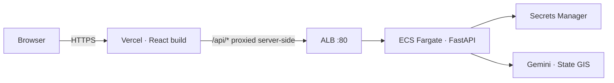

# Deploying to AWS

Two artefacts: a Python API container and a static React bundle. The bundle
goes to Vercel; the container goes to AWS.



## The working path: ECS Fargate

`deploy-apprunner.sh` exists and is simpler, but **App Runner is unavailable
on a free-plan AWS account** — every region returns
`SubscriptionRequiredException`. ECS Fargate uses primitives every account
has, so that is the path that shipped.

```bash
export AWS_PROFILE=<profile>
export AWS_REGION=us-east-1
export GEMINI_API_KEY=...

./deploy-ecs.sh
```

The script is idempotent. It builds the image for `linux/amd64` (Fargate is
x86), pushes to ECR, stores the key in Secrets Manager, creates the execution
role, ALB, target group, task definition and service, then waits for the
target to report healthy and prints the DNS name.

### Front end

```bash
cd web
sed -i "s|REPLACE_WITH_ALB_DNS|<alb-dns>|" vercel.json
npm run build && npx vercel deploy --prod
```

Deploy from the **CLI**, not the Vercel GitHub import. The import page detects
the repo root as a FastAPI project and would deploy the backend; it also picks
up backend environment variables that have no business in a browser bundle. If
you do use the UI, set root directory to `web`, preset to Vite, and remove
every detected environment variable.

### Tear down

```bash
./destroy-ecs.sh
```

Removes the service, ALB, target group, cluster, ECR repository, secret, log
group, security group, and the IAM roles — including leftovers from an App
Runner attempt.

## Four things worth knowing

**The ALB serves HTTP only.** Terminating TLS on it requires an ACM
certificate, which requires a domain you control. Instead `web/vercel.json`
rewrites `/api/*` to the ALB **server-side**: the browser only ever speaks
HTTPS to Vercel, and the plaintext hop happens between Vercel and AWS. The
frontend defaults to a relative `/api`, so no build-time API URL is needed and
nothing breaks if the ALB DNS changes.

**ECS creates its service-linked role lazily.** On a new account the first
`create-service` call fails *while* creating `AWSServiceRoleForECS`. The role
exists afterwards, so re-running the script succeeds. Do not go hunting for a
permissions problem.

**State is container-local.** There is no EFS volume: generated imagery and
the SQLite database live in the container and a task restart clears them. For
a short demo the user simply scans again. To persist, mount an EFS volume at
`/app/var` or sync `var/` to S3 — `store.py` is the only module that would
need to change for a real database.

**Absolute paths do not survive a container.** Image paths are recorded
absolute when written, so a database seeded on a laptop points at `/home/...`
inside the container and every image 404s. `_resolve_asset` falls back to
matching the filename under the configured directories. This was found by
running the built image rather than trusting it.

## Health and cost

- ALB target group health check: `GET /health`
- Container logs: `aws logs tail /ecs/curbside --follow`
- `GET /config` reports what is configured and what would block a live send

| | Two days |
|---|---|
| Fargate 1 vCPU / 2 GB | $2.37 |
| ALB hourly + LCU | $1.46 |
| ECR + Secrets Manager | $0.03 |
| **Total** | **$3.86** |

**$58.74/month** if left running. The ALB is the bulk of the fixed cost, which
is why App Runner is cheaper where it is available.

## Scaling past the prototype

| Concern | Change |
|---|---|
| Concurrent writes | RDS Postgres — `store.py` is the only module affected |
| Image storage | S3 instead of container disk; store keys, not paths |
| Long renders | SQS + a worker service; stages are already independent |
| Multi-tenant | Add a tenant column and scope every query |

The pipeline stages are pure functions over the store, so none of this touches
the render, QC or compliance logic.
