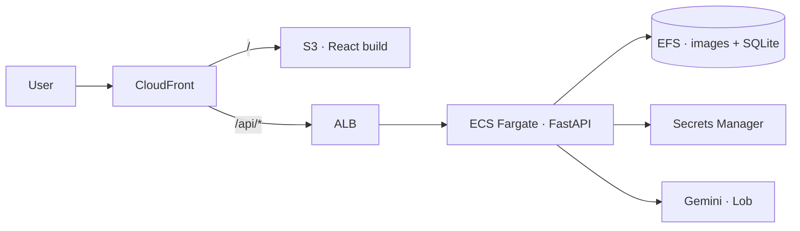

# Deploying to AWS

Two artefacts: a Python API container and a static React bundle.



## 1 · Build

```bash
# API image
docker build -t curbside-api .

# Front end
cd web && npm ci && npm run build      # -> web/dist
```

## 2 · Push the image

```bash
aws ecr create-repository --repository-name curbside-api
aws ecr get-login-password --region us-east-1 \
  | docker login --username AWS --password-stdin <acct>.dkr.ecr.us-east-1.amazonaws.com

docker tag curbside-api:latest <acct>.dkr.ecr.us-east-1.amazonaws.com/curbside-api:latest
docker push <acct>.dkr.ecr.us-east-1.amazonaws.com/curbside-api:latest
```

## 3 · Secrets

Never bake keys into the image. Store them and reference by ARN in the task
definition.

```bash
aws secretsmanager create-secret --name curbside/gemini \
  --secret-string '{"GEMINI_API_KEY":"..."}'
aws secretsmanager create-secret --name curbside/lob \
  --secret-string '{"LOB_API_KEY":"..."}'
```

## 4 · Persistent state

The API writes SQLite plus generated imagery to `var/`. On Fargate that must be
an **EFS** volume mounted at `/app/var`, otherwise state vanishes on every task
replacement.

```json
"mountPoints": [{ "sourceVolume": "curbside-var", "containerPath": "/app/var" }]
```

## 5 · Environment

| Variable | Purpose |
|---|---|
| `GEMINI_API_KEY` | from Secrets Manager |
| `CURBSIDE_FROM_*` | return address — required to compose |
| `CURBSIDE_SOURCE` | `indiana` · `connecticut` · `north_carolina` |
| `CURBSIDE_BUDGET` | hard spend ceiling |
| `CURBSIDE_DAILY_MAIL_CAP` | pieces per run |
| `CURBSIDE_CORS_ORIGINS` | your CloudFront domain |
| `LOB_API_KEY` | only when mailing for real |
| `CURBSIDE_ALLOW_LIVE_MAIL` | `1` to permit a live send |
| `CURBSIDE_ACK_STATES` | states cleared by counsel |

## 6 · Front end

```bash
aws s3 sync web/dist s3://curbside-web --delete
aws cloudfront create-invalidation --distribution-id <id> --paths "/*"
```

Point the CloudFront `/api/*` behaviour at the ALB. The bundle calls `/api` by
default; override with `VITE_API_BASE` at build time.

## 7 · Health and cost

- ALB target group health check: `GET /health`
- Alarm on the ECS task and on **AWS Budgets** — the pipeline's own
  `CURBSIDE_BUDGET` caps model spend, but not infrastructure spend.
- `GET /config` reports what is configured and what would block a live send.

## Scaling past the prototype

SQLite on EFS is fine into the low thousands of leads. Past that:

| Concern | Change |
|---|---|
| Concurrent writes | RDS Postgres — `store.py` is the only module affected |
| Image storage | S3 instead of EFS; store keys, not paths |
| Long renders | SQS + a worker service; the stages are already independent |
| Multi-tenant | Add a tenant column and scope every query |

The pipeline stages are pure functions over the store, so none of this touches
the render, QC, or compliance logic.
